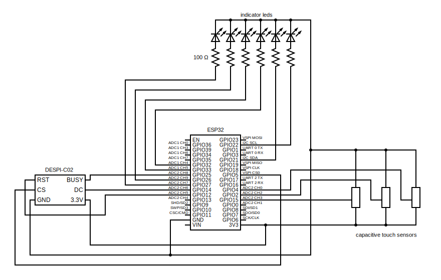
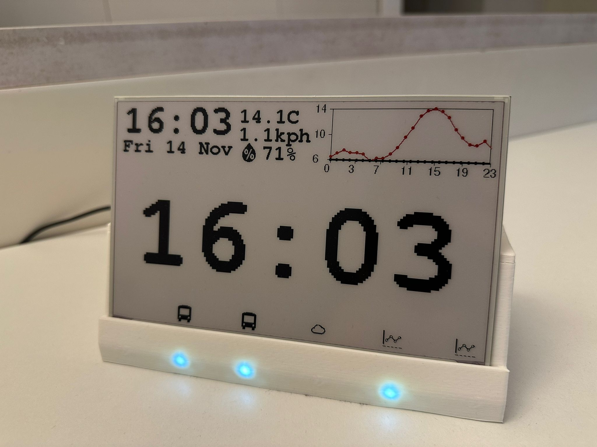
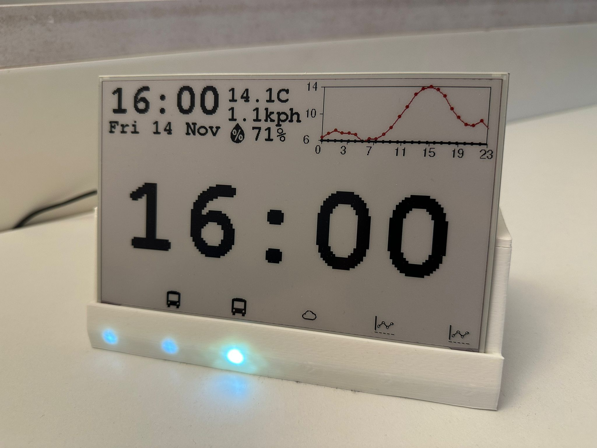
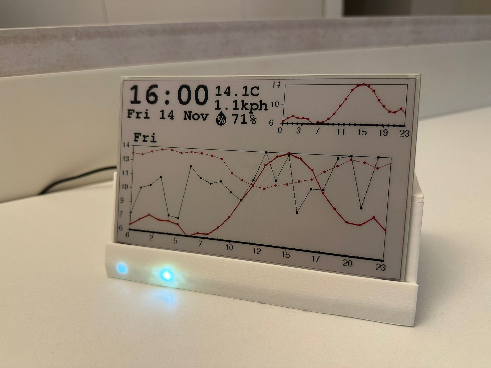
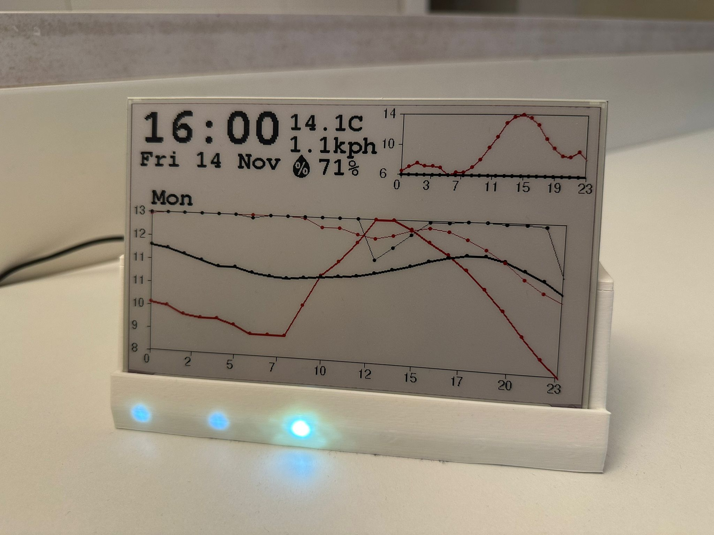
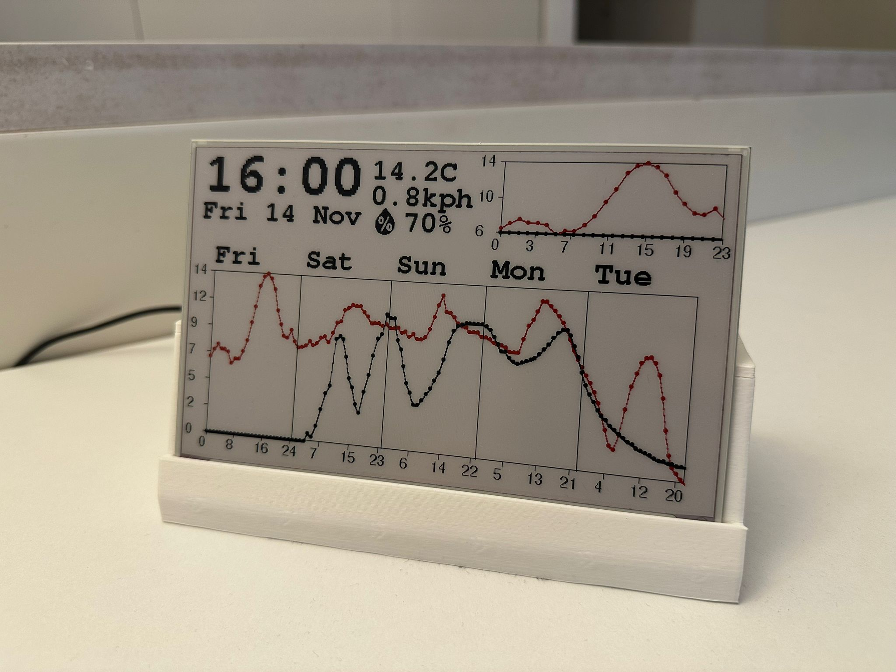
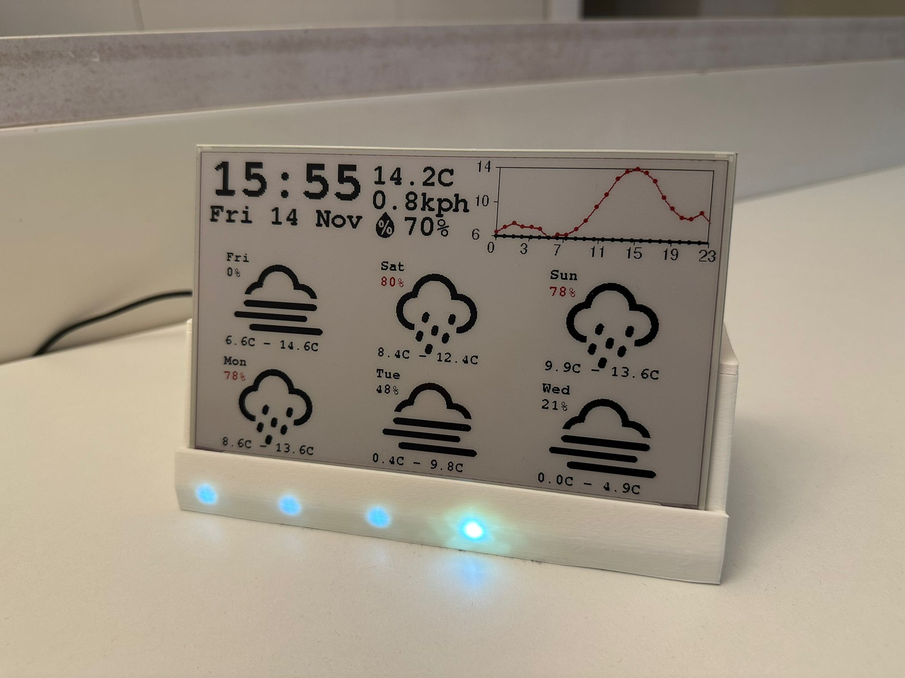
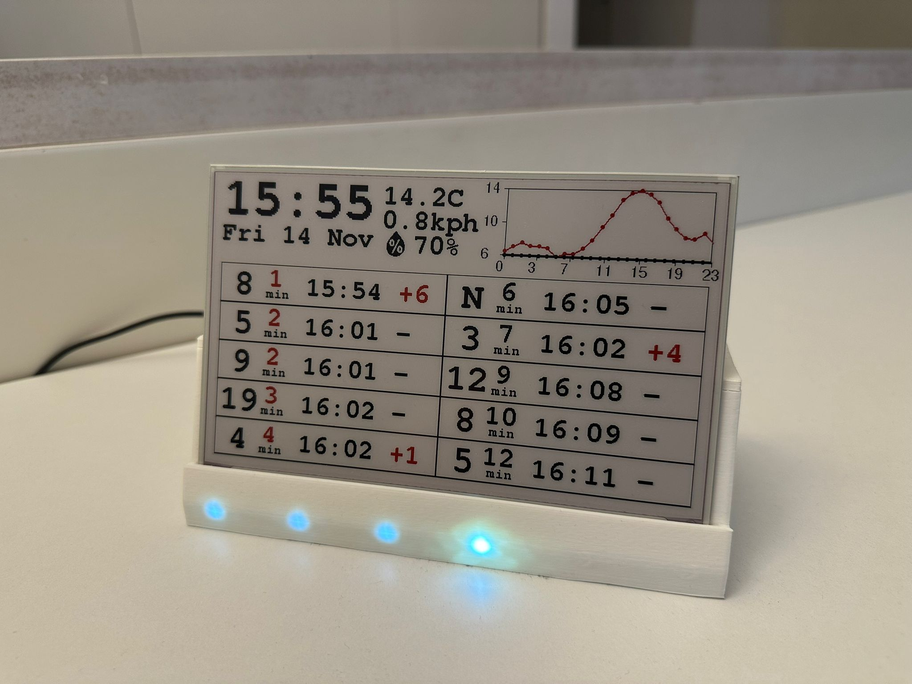
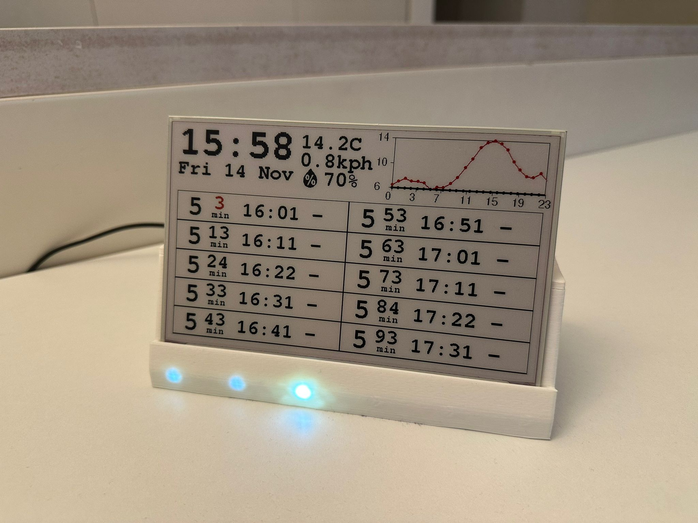
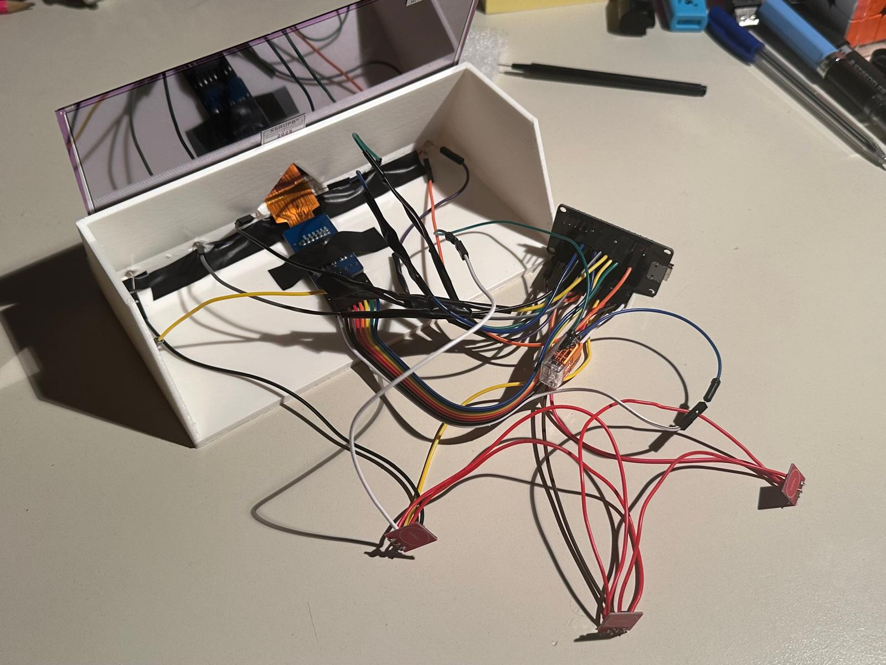

# E-Ink buddy
A simple e-ink display that shows time, date, weather, and other useful information.
## Features
- Time and Date display
- 5 minute update option with led minute indicator or 1 minute update with second indicator
- Multiple tabs for different information
- Weather information and graphics
- 24h and 5-day weather forecast graphs
- Bus arrival times for specified stops

## Hardware
- HINK-E075A01-A8 7.5″ three-color (black/white/red) E‑Ink panel 640×385
   - Any compatible e-ink display should work with minor adjustments to the graphics library. It just needs to be supported by the GxEPD2 library.

- Good Display DESPI-C02 adapter board

- ESP32-wroom-32 CP2102 (any ESP32 board should work)

- 6 leds

- 3 capacitive buttons

- 3D printed case (STL files included (to be uploaded))

## Wiring

## Software
The project uses the following external libraries:
- GxEPD2 by ZinggJM
- Adafruit GFX by Adafruit
- ArduinoJson by Benoit Blanchon

The project itself is written using the arduino framework in PlatformIO.
## Architecture
The project is divided into several modules that each handle a specific functionality and communicates via structures.

### graphics.cpp
Handles all graphics rendering on the e-ink display. It uses the GxEPD2 and Adafruit GFX libraries to draw text and images.
It also contains helper functions for rendering headers, graphs and other elements.

### weather.cpp
Handles fetching and parsing weather data from open-meteo.com. It retrieves current weather conditions and forecasts, and provides functions to get weather forecasts and data points for graphs.
All weather icons are stored as bitmaps in the `bitmaps.h` file.
For more information consult the header file that contains documentation for all functions and structures.

### tr_api.cpp
Handles fetching and parsing bus arrival times from the Trentino trasporti API. It retrieves upcoming bus times for specified stops and provides functions to get stop information and arrival times.
For more information consult the header file that contains documentation for all functions and structures.
Thanks to [trentino-trasporti-api](https://github.com/matteocontrini/trentino-trasporti-api) for the API documentation.
Sample API calls can be found in the `Sample_calls` folder, both for buses and weather.

### helper.cpp
Contains various printing and debugging functions used throughout the project.

### main.cpp
The main application logic. It initializes the hardware and software components, handles user input, and manages the display updates.
It works with tasks to update different parts of the display in the background.
There is `the-timekeeper-task` that handles timekeeping and user input, and starts several other tasks for updating weather, bus times, and other information.
The tabs system is implemented as a pseudo finite-state machine, where each tab is a state that can be switched by user input.

## Images
Main screen with time, date, and small 24h weather graph in minute update mode:

Main screen with time, date, and led minute indicator in 5 minute update mode:

24h graph (it shows temperature, precipitation probability, cloud cover and humidity):

The graph can be shifted up to 6 days into the future using the rear buttons:

5-day weather forecast graph (it shows hourly temperature and precipitation probability for the next 5 days, this can also be shifted using the rear buttons up to 6 days into the future):

6 day weather forecast tab (shows daily high/low temperature, precipitation probability and weather icons for the next 6 days):

Non filtered bus arrival times for a specified stop (the list can be scrolled using the rear buttons):

Filtered bus arrival times for a specified stop (only the bus number 5 is shown):

The awful prototyping wiring:

Bitmaps taken from [weather-icons](https://github.com/erikflowers/weather-icons/tree/master?tab=readme-ov-file). 
 Thanks again to [trentino-trasporti-api](https://github.com/matteocontrini/trentino-trasporti-api) for the API documentation.